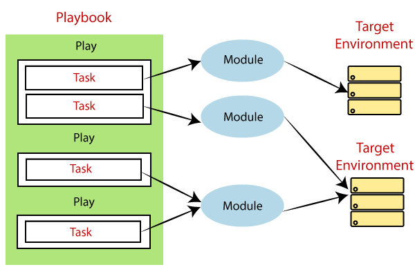

# 创建 playbook

所谓 playbook，是 YAML 格式的自动化蓝图，automation blueprints, in `YAML` format，Ansible 使用 playbook 来部署和配置托管节点。

- **模组，module**
    Ansible 在托管节点上，要运行的代码或二进制文件的一个单元。Ansible 模组以集合形式分组，每个组别都有个完全限定集合名称（Fully Qualified Collection Name, FQCN）。

- **任务，task**
    对某单个定义了 Ansible 所执行操作模组的引用。

- **Play**
    映射到仓库中一些托管节点的有序任务列表。

- **Playbook**
    定义出 Ansible 从上到下执行操作，以实现总体目标顺序的 play 列表。

> **译注**：下图是 Ansible 模组、任务、play 与 playbook 的关系图示。可以看出其中模组是直接作用于托管主机/系统的单元。任务、play 和 playbook 是将简单的模组，组织为复杂操作的方式，而任务是介于模组与 play 之间的桥梁（模组 <--> 任务 <--> play）。



*图 2-1，Ansible 模组、任务、play 与 playbook 之间的关系图*

请完成以下步骤，创建一个用于对咱们主机进行 `ping` 操作，并打印出 “Hello World” 消息的 playbook：

1. 在先前创建的 `ansible_quickstart` 目录中，创建一个名为 `playbook.yaml` 的文件，内容如下：

```yaml
{{#include ../ansible_quickstart/playbook.yaml}}
```

2. 运行咱们的 playbook。

```console
ansible-playbook -i ansible_quickstart/inventory_updated.yaml ansible_quickstart/playbook.yaml
```

Ansible 会返回以下输出：

```console
{{#include ../ansible_quickstart/playbook.output}}
```

> **译注**：输出中包含有关托管主机上发现的 Python 版本告警已被省略：

```console
[WARNING]: Platform linux on host web_100 is using the discovered Python
interpreter at /usr/bin/python3.8, but future installation of another Python
interpreter could change the meaning of that path. See
https://docs.ansible.com/ansible-
core/2.18/reference_appendices/interpreter_discovery.html for more information.
[WARNING]: Platform linux on host web_109 is using the discovered Python
interpreter at /usr/bin/python3.8, but future installation of another Python
interpreter could change the meaning of that path. See
https://docs.ansible.com/ansible-
core/2.18/reference_appendices/interpreter_discovery.html for more information.
```
