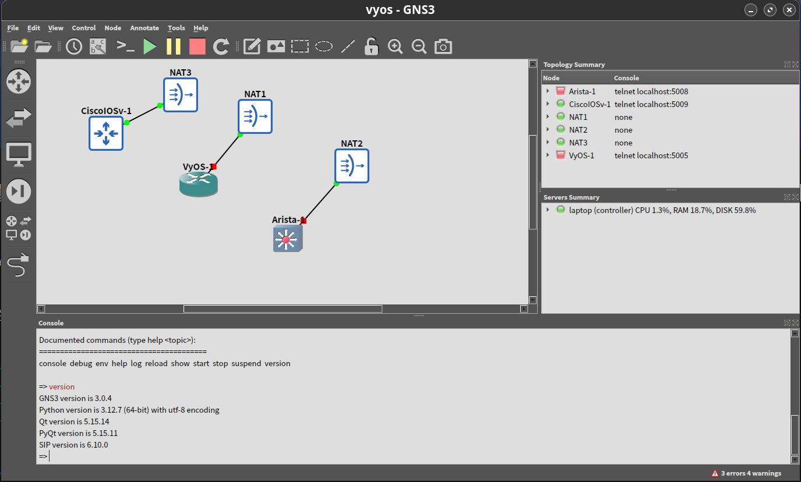

# 运行咱们的首个命令及 playbook


通过这个快速教程，将咱们所学到的概念付诸实践。请安装 Ansible，手动执行一条网络配置命令，接着使用 Ansible 执行同一命令，然后创建一个 playbook，这样咱们就可以随时在多个网络设备上执行该命令。


## 先决条件


在学习本教程之前，咱们需要：


- 安装了 Ansible 2.10 （或更高版本）；
- 一个或多个与 Ansible 兼容的网络设备；
- 基本的 Linux 命令行知识；
- 网络交换机和路由器配置的基本知识。


> **译注**：针对这个教程的操作，译者使用了运行在 KVM 上的 VyOS/Arista/Cisco ISOv/HUAWEI CE12800 等虚拟机进行实验。




> 参考：
>
> - [VyOS `.qcow2` 镜像添加](https://ccna60d.xfoss.com/GNS3_tutorial.html#vyos-qcow2-%E9%95%9C%E5%83%8F%E6%B7%BB%E5%8A%A0)
>
> - [Accuris Technologies Public CDN (Server Location: Las Vegas, NV, USA)](https://cdn.as212934.net/routers/VyOS/)
>
> - [Running on Libvirt Qemu/KVM](https://docs.vyos.io/ja/latest/installation/virtual/libvirt.html)


## 安装 Ansible

使用咱们的首选方法安装 Ansible。请参阅 [安装 Ansible](../installing.md)。然后返回本教程。


确认 Ansible 的版本（必须 `>= 2.10`）：


```console
$ ansible --version                                                                                            ✔
ansible [core 2.18.1]
  config file = /home/hector/.ansible.cfg
  configured module search path = ['/home/hector/.ansible/plugins/modules', '/usr/share/ansible/plugins/modules']
  ansible python module location = /home/hector/.pyenv/versions/3.12.7/lib/python3.12/site-packages/ansible
  ansible collection location = /home/hector/.ansible/collections:/usr/share/ansible/collections
  executable location = /home/hector/.pyenv/versions/3.12.7/bin/ansible
  python version = 3.12.7 (main, Dec 25 2024, 16:19:47) [GCC 14.2.1 20240910] (/home/hector/.pyenv/versions/3.12.7/bin/python3.12)
  jinja version = 3.1.5
  libyaml = True
```


## 建立到托管节点的手动连接


要确认咱们的凭据，就要手动连接到某个网络设备并获取其配置。请用咱们的真实凭据，替换下面示例用户和设备名称。例如，对于 VyOS 路由器：


```console
ssh hector@vyos_r1
show config
exit
```

这一手动连接还确立了该网络设备的真实性，将其 RSA 密钥指纹添加到咱们的已知主机列表中（`~/.ssh/known_hosts`）。(若赞m之前连接过设备，则咱们就已经确定了其真实性。）


## 运行咱们的首个网络 Ansible 命令

咱们只需一条精简的 Ansible 命令，就能检索其配置，而无需手动连接该网络设备，然后在其上运行命令：


```console
ansible all -i vyos-r1, -c ansible.netcommon.network_cli -u hector -k -m vyos.vyos.vyos_facts -e ansible_network_os=vyos.vyos.vyos
```

**这条命令中的命令行开关，设置了 7 个值**：

- 该命令会应用到的主机组（在本例中为 `all`）；
- 仓库（`-i`，目标设备 -- 在其后不带逗号时 `-i` 会指向某个仓库文件）；
- 连接方式（`-c`，连接及执行 `ansible` 的方式）；
- 用户（`-u`，SSH 连接的用户名）；
- SSH 连接方式（`-k`，请提示输入密码）；
- 模组（`-m`，要运行的 Ansible 模组，使用的是完全合格的专辑名字，FQCN)；
- 额外变量（`-e`，在本例中，设置的是网络操作系统的值）。


**注意**：若咱们与 SSH 密钥一起了 `ssh-agent`，那么 Ansible 会自动加载 SSH 密钥。此时咱们可省略 `-k` 这个命令行开关。

> **译注**：运行上述命令需要安装 `paramiko` 或 `ansible-pylibssh`。

```console
python -m pip install ansible-pylibssh paramiko
```

> 在使用 `paramiko` 时，会显示告警 `[WARNING]: ansible-pylibssh not installed, falling back to paramiko`。


> **注意**：若咱们在虚拟环境中运行 Ansible，则还需添加变量 `ansible_python_interpreter=/path/to/venv/bin/python`。

> **译注**：经测试，即使在虚拟环境中运行 Ansible，也无需添加该变量。


## 创建并运行咱们的首个网络 Ansible Playbook


如果咱们打算每天都运行这条命令，那么咱们可以把他保存在一个 playbook 中，然后以 `ansible-playbook` 而非 `ansible` 运行他。Playbook 可以存储大量咱们在命令行中用命令行开关提供的参数，从而减少在命令行中的输入。为此，咱们需要两个文件 -- playbook 和仓库文件。


1. 创建 playbook `~/ansible-tutorial/network_run/first_playbook.yml`。


```yaml
{{#include ../../network_run/first_playbook.yml}}
```


> **译注**：其中原文为 `gather_subset: all`，有于实验用的 VyOS 为 `1.4.0` 版本中存在 Bug。故这里做了修改。
>
> 参考：
>
> - [LLDP error in gather_subset in vyos.vyos.vyos_facts](https://vyos.dev/T6898)
>
> - [vyos.vyos.vyos_facts module – Get facts about vyos devices.](https://docs.ansible.com/ansible/latest/collections/vyos/vyos/vyos_facts_module.html#parameter-gather_subset)


对应的仓库文件为：


```yaml
routers:
  hosts:
    vyos-r1:
      ansible_host: 192.168.122.189
      ansible_user: hector
      ansible_network_os: vyos.vyos.vyos
      ansible_connection: ansible.netcommon.network_cli
```


对于上面命令行中的七个值中，playbook 与仓库设置了三个：主机（`hosts: vyos-r1`）、连接方法（`ansible_connection: ansible.netcommon.network_cli`）和模组（在各个任务中）。在 playbook 与仓库文件中设置了这些值后，就可以在命令行中省略他们。这个 playbook 还添加了第二个任务，以显示该 VyOS 路由器的配置输出。当某个模组在 playbook 中运行时，其输出会保存在内存中，供今后任务使用，而非写入控制台。其中的 `debug` 任务可以让咱们在 shell 中看到结果。


2. 使用以下命令运行该 playbook：

```console
cd ~/ansible-tutorial/network_run
ansible-playbook -i inventory.yml first_playbook.yml
```


该 playbook 包含了有两项任务的一个 play，应产生如下输出：


```console
$ ansible-playbook -i inventory.yml first_playbook.yml

PLAY [Network Getting Started First Playbook] *************************************************************************

TASK [Get config for VyOS devices] ************************************************************************************
ok: [vyos-r1]

TASK [Display the config] *********************************************************************************************ok: [vyos-r1] => {
    "msg": "The hostname is vyos and the OS is VyOS 1.4.0"
}

PLAY RECAP ************************************************************************************************************vyos-r1                    : ok=2    changed=0    unreachable=0    failed=0    skipped=0    rescued=0    ignored=0

```


3. 既然咱们可以获取到设备配置，就要试试用 Ansible 更新他。请创建咱们首个 playbook 的扩展版本 `first_playbook_ext.yml`：


{{#include ../../network_run/first_playbook_ext.yml}}


这个扩展后的首个 playbook，在一个 play 中包含了 5 个任务。用上面同样的命令运行他。输出将显示给咱们，Ansible 对配置所做的更改：


```console
$ ansible-playbook -i inventory.yml first_playbook_ext.yml                    2 ✘

PLAY [Network Getting Started First Playbook Extended] ************************************************************************************

TASK [Get config for VyOS devices] ********************************************************************************************************ok: [vyos-r1]

TASK [Display the config] *****************************************************************************************************************
ok: [vyos-r1] => {
    "msg": "The hostname is vyos-r1 and the OS is VyOS 1.4.0"
}

TASK [Update the hostname] ****************************************************************************************************************
[WARNING]: To ensure idempotency and correct diff the input configuration lines should be similar to how they appear if present in the
running configuration on device
changed: [vyos-r1]

TASK [Get changed config for VyOS devices] ************************************************************************************************
ok: [vyos-r1]

TASK [Display the changed config] *********************************************************************************************************
ok: [vyos-r1] => {
    "msg": "The new hostname is vyos-r1 and the OS is VyOS 1.4.0"
}

PLAY RECAP ********************************************************************************************************************************
vyos-r1                    : ok=5    changed=1    unreachable=0    failed=0    skipped=0    rescued=0    ignored=0

```

> **译注**：可能是 `vyos.vyos` 专辑中的 bug，上面的实验输出，并未反应出该 VyOS 设备 `hostname` 的变化。


## 从网络设备收集事实


`gather_facts` 关键字现在支持以标准化的键/值对形式，收集网络设备的事实。咱们可将这些网络事实，输入到今后的任务中，以管理网络设备。


咱们还可以将新的 `gather_network_resources` 参数与网络设备的 `*_facts` 模组（如 `arista.eos.eos_facts`）一起使用，而只返回该设备配置的子集，如下所示。


```yaml
- hosts: arista
  gather_facts: True
  gather_subset: interfaces
  module_defaults:
    arista.eos.eos_facts:
      gather_network_resources: interfaces
```

> **注意**：这个 playbook 针对 Arista 设备的 playbook，在 GNS3 上未通过实验。报出 `Failed to create temporary directory. In some cases, you may have been able to authenticate and did not have permissions on the target directory. ...` 错误。后修改该 playbook 为下面这样。

```yaml
{{#include ../../network_run/arista_facts.yml}}
```

> 搭配下面的仓库文件。

```yaml
leafs:
  hosts:
    vyos-r1:
      ansible_host: 192.168.122.189
      ansible_user: hector
      ansible_network_os: vyos.vyos.vyos
    arista-sw:
      ansible_host: 192.168.122.116
      ansible_user: admin
      ansible_ssh_private_key_file: /home/hector/.ssh/id_ecdsa.pub
      ansible_network_os: arista.eos.eos
  vars:
    ansible_connection: ansible.netcommon.network_cli
```

> 然后使用命令 `ansible-playbook -i inventory.yml arista_facts.yml -bK` 运行成功。其中 `-bK` 表示 playbook 中的 `arista.eos.eos_facts` 任务需要权限提升，否则会给出警告：`"show running-config | section ^interface\r\n% Invalid input (privileged mode required)\r\nlocalhost>"`。

该 playbook 会返回以下这些接口事实：

```json
{{#include ./arista_facts.output}}
```


注意其中的 `gather_network_resources` 会将所有支持资源（接口、`bgp`、`ospf` 等）的配置数据作为事实呈现，而 `gather_subset` 主要用于获取运行数据。

咱们可存储这些事实，并在其他任务中直接使用，例如使用 `eos_interfaces` 资源模组。


（End）

