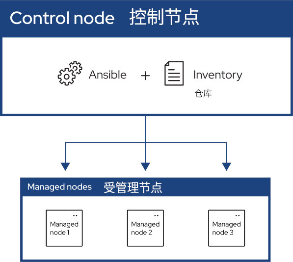

# 前言

Ansible 大约每年发布两次新的重要版本。核心应用程序的发展略显保守，以重视语言设计及设置的简洁性。贡献者可以更快地开发和更改模块和插件，并将其托管在专辑中。

## Ansible 入门

Ansible 让远程系统的管理自动化，并控制其所需状态。

如上图所示，大多数 Ansible 环境都有三个主要组件：

- 控制节点

安装了 Ansible 的系统。咱们在控制节点上运行 Ansible 命令，如 `ansible` 或 `ansible-inventory`。

- 仓库

按逻辑组织的受管理节点列表。咱们可以在控制节点上创建一个清单，以向 Ansible 描述主机部署情况。

- 受管理节点

Ansible 控制的远端系统或主机。

## Ansible 简介

Ansible 提供可降低复杂性，并随处运行的开源自动化功能。使用 Ansible 几乎可以实现任何任务的自动化。以下是 Ansible 的一些常见用例：

- 消除重复，简化工作流程

- 管理和维护系统配置

- 持续部署复杂软件

- 完成零停机时间的滚动更新

Ansible 使用简单、人类可读的脚本（称为 playbook），来自动执行任务。咱们可以在 playbook 中，声明本地或远端系统所需的状态。Ansible 可确保该系统保持该状态。

作为自动化技术，Ansible 的设计遵循以下原则：

- **无代理架构，agent-less architecture**

通过避免在 IT 基础设施中安装额外软件，从而降低维护开销。

- **简约，simplicity**

自动化 playbooks 使用简单明了的 YAML 语法，编写出读起来就像文档一样的代码。Ansible 还是去中心化的，他使用 SSH 和现有的操作系统凭据，访问远程机器。

- **可扩展及灵活性，scalability and flexibility**

经由支持多种操作系统、云平台和网络设备的模块化设计，可轻松快速地扩展自动化系统。

- **幂等性和可预测性，idempotence and predictability**

若系统已经处于咱们 playbook 所描述的状态，即使 playbook 运行多次，Ansible 也不会改变任何东西。

> **注**：关于幂等性：幂等性（Idempotence）（英：/ˌɪdɛmˈpoʊtəns/， 美：/ˈaɪdəm-/） 是数学和计算机科学中某些运算的特性，即运算可以多次应用，而不会改变最初应用之外的结果。
> -- [Wikipedia: Idempotence](https://en.wikipedia.org/wiki/Idempotence)
