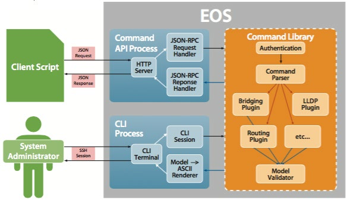

# `httpapi` 插件

`httpapi` 插件告诉 Ansible，如何与远端设备基于 HTTP 的 API 交互，以及在该设备上执行任务。

各个插件代表一种特定的 API 方言。有些是特定于平台（Arista eAPI、Cisco NXAPI 等）的，而别的则可用于各种平台（`RESTCONF`）。Ansible 会根据 `ansible_network_os` 变量，自动加载相应的 `httpapi` 插件。

> **译注**：`httpapi` 是通过设备提供的 RESTful API，管理设备所需的插件。下图是 Arista® eAPI® 的架构图。




## 添加 `httpapi` 插件

通过将自定义插件放入 `httpapi_plugins` 目录，咱们可扩展 Ansible 以支持别的 API。详情请参阅 [开发 `httpapi` 插件](https://docs.ansible.com/ansible/latest/network/dev_guide/developing_plugins_network.html#developing-plugins-httpapi)。


## 使用 `httpapi` 插件

要使用的 `httpapi` 插件，由 `ansible_network_os` 这个变量自动决定。

大多数 `httpapi` 插件无需配置即可运行。各个插件也可能会定义一些额外选项。

这些插件都自带文档。各个插件都应记录了其配置选项。

以下示例 playbook 展示了某个 Arista 网络设备的 `httpapi` 插件，假设有个仓库变量被设置为 `ansible_network_os=eos`，以触发该 `httpapi` 插件：


```yaml
- hosts: leaf01
  connection: httpapi
  gather_facts: false
  tasks:

    - name: type a simple arista command
      eos_command:
        commands:
          - show version | json
      register: command_output

    - name: print command output to terminal window
      debug:
        var: command_output.stdout[0]["version"]
```

> **译注**：这个 playbook 中的 `hosts: leaf01` 是指一般用于数据中心的 [Spine-Leaf 网络拓扑](../../../building_an_inventory.md#建立仓库的一些技巧) 中的叶子交换机。

请查看 [GitHub 上](https://github.com/network-automation/httpapi) 的完整工作示例。


## 查看 `httpapi` 插件

这些插件都已迁移到 [Ansible Galaxy](https://galaxy.ansible.com/) 上的专辑。若咱们使用 `pip` 安装了 2.10 或更高版本的 Ansible，就可访问到多个 `httpapi` 插件。咱们可使用 `ansible-doc -t httpapi -l` 命令查看可用插件的列表。使用 `ansible-doc -t httpapi <plugin name>` 查看特定插件的文档与示例。

（End）


