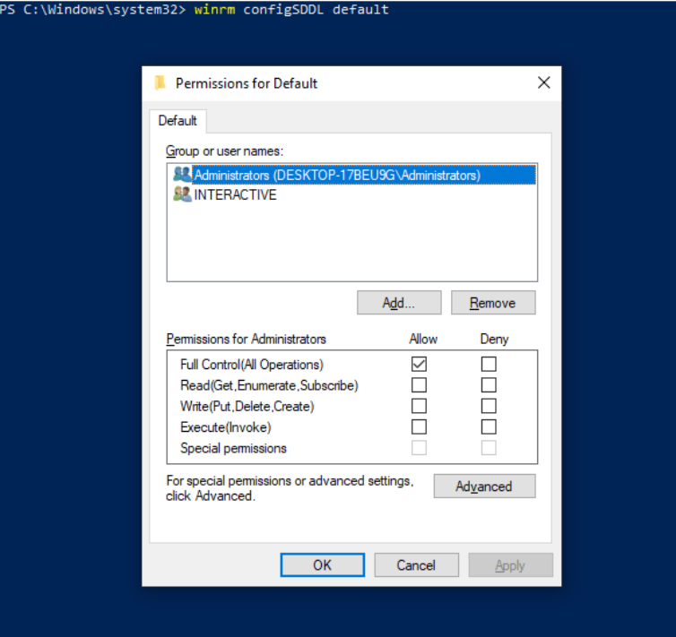

# Windows 远程管理

与默认使用 SSH 的 Linux/Unix 主机不同，Windows 主机是以 WinRM 配置的。这个主题介绍如何在 Ansible 下，配置和使用 WinRM。


## WinRM 为何？


WinRM 是由 Windows 用到的一种，与另一服务器进行远程通信的管理协议。他是透过 HTTP/HTTPS 通信的一种基于 SOAP 的协议<sup>1</sup>，并被包含在所有最近的 Windows 操作系统中。自 Windows Server 2012 起，WinRM 就已默认启用，但在某些情况下，要在 Ansible 下使用 WinRM，需要额外配置。


Ansible 可通过 `psrp` 或 `winrm` 连接插件使用 WinRM。这些插件有其自身的、不包含在 Ansible 包中的一些 Python 要求，必须单独安装。


若咱们选择的是 `pipx` 安装指令，则可通过运行以下命令，安装这些要求：


```console
pipx inject "pypsrp<=1.0.0"  # for psrp
pipx inject "pywinrm>=0.4.0"  # for winrm
```

或者，若咱们选择了 `pip` 安装指令：


```console
pip3 install "pypsrp<=1.0.0"  # for psrp
pip3 install "pywinrm>=0.4.0"  # for winrm
```


> <span style="background-color: #f0b37e; color: white; width: 100%"> **警告**：</span>
>
> 在 MacOS 上使用 Ansible 中最新版本的 `winrm` 或 `psrp` 连接插件，通常会失败。这是一个发生在 Python 栈深处的已知问题，且 Ansible 无法改变这个问题。目前唯一的解决方法，是设置环境变量 `OBJC_DISABLE_INITIALIZE_FORK_SAFETY=yes`、`no_proxy=*`，并避免使用 Kerberos 认证。


## WinRM 设置


在 Ansible 使用 WinRM 连接前，Windows 主机必须配置一个 WinRM 监听器。该监听器将监听所配置的端口，并接受传入的 WinRM 请求。

尽管这个指南会详细介绍如何枚举、添加及移除监听器，咱们也可运行以下 PowerShell 代码片段，使用默认值设置 HTTP 监听器：


```powershell
{{#include ./http_winrm_setup.ps1}}
```

要一个带有自签名证书的 HTTPS 监听器，我们可以运行以下 PowerShell 脚本：


```powershell
{{#inclue ./https_winrm_setup.ps1}}
```


> <span style="background-color: #f0b37e; color: white; width: 100%"> **警告**：</span>
>
> 上面的脚本仅用于演示目的，在生产环境中运行前应进行审核。某些更改，如对所有传入连接打开防火墙端口、允许 WinRM 使用本地账户、自签名证书等，可能不适合所有环境。


### 枚举监听器

查看 WinRM 服务上当前正运行的监听器：


```powershell
PS C:\Users\Hector PENG> winrm enumerate winrm/config/Listener
Listener
    Address = *
    Transport = HTTPS
    Port = 5986
    Hostname
    Enabled = true
    URLPrefix = wsman
    CertificateThumbprint = 7B6D54831B5E8C2121B2070F342ED4A07F5E9F79
    ListeningOn = 127.0.0.1, 192.168.122.133, ::1, fe80::d199:fc5d:602a:f343%2

```

在上面的示例中，配置了一个 WinRM 监听器。该监听器透过 HTTPS 在端口 5986 上监听。需要了解的一些关键选项如下：

- `Transport`：该监听器是透过 HTTP 还是 HTTPS 运行；
- `Port`：要监听的端口，默认 HTTP 为 `5985`，HTTPS 为 `5986`；
- `CertificateThumbprint`：对于 HTTPS，这是用于 TLS 连接的证书指纹。

> **译注**：这里的 `CertificateThumbprint`，原文称为 the thumbprint of the certificate，就是证书指纹，是证书的唯一标识符。微软将证书指纹成为 Thumbprint。
>
> 参考：[How to check a certificate's thumbprint](https://knowledge.digicert.com/solution/how-to-check-a-certificates-thumbprint)

要查看由该 `CertificateThumbprint` 所指定的证书详细信息，咱们可运行以下 PowerShell 命令：

```powershell
$thumbprint = "E6CDAA82EEAF2ECE8546E05DB7F3E01AA47D76CE"
Get-Item -Path "Cert:\LocalMachine\My\$thumbprint" | Select-Object *
```

### 创建监听器

通过 `Enable-PSRemoting` 这个 cmdlet 就可以创建出 HTTP 监听器，但咱们也可以使用下面的 PowerShell 代码，手动创建 HTTP 监听器。


```powershell
$listenerParams = @{
    ResourceURI = 'winrm/config/listener'
    SelectorSet = @{
        Transport = "HTTP"
        Address   = "*"
    }
    ValueSet    = @{
        Enabled = $true
        Port    = 5985
    }
}
New-WSManInstance @listenerParams
```

创建 HTTPS 监听器与之类似，但端口现在是 `5986`，且必须设置 `CertificateThumbprint` 值。证书可以是自签名证书，也可以是证书颁发机构颁发的证书。如何生成证书不在本节讨论范围之内。


```powershell
$listenerParams = @{
    ResourceURI = 'winrm/config/listener'
    SelectorSet = @{
        Transport = "HTTPS"
        Address   = "*"
    }
    ValueSet    = @{
        CertificateThumbprint = 'E6CDAA82EEAF2ECE8546E05DB7F3E01AA47D76CE'
        Enabled               = $true
        Port                  = 5986
    }
}
New-WSManInstance @listenerParams
```

`CertificateThumbprint` 值必须设置为已安装在 `LocalMachine\My` 证书存储中某个证书的指纹。


其中的 `Address` 选择器值，可被设置为以下三种值之一：


- `*` - 绑定到所有地址；
- `IP:...` - 绑定到以 `...` 指定的 IPv4 或 IPv6 地址；
- `MAC:32-a3-58-90-be-cc` - 绑定到有着所指定 MAC 地址的网络适配器。


### 移除监听器

以下代码可移除所有监听器，或某个特定监听器：


```powershell
 # Removes all listeners
 Remove-Item -Path WSMan:\localhost\Listener\* -Recurse -Force

 # Removes only HTTP listeners
 Get-ChildItem -Path WSMan:\localhost\Listener |
     Where-Object Keys -contains "Transport=HTTP" |
     Remove-Item -Recurse -Force

# Removes only HTTPS listeners
 Get-ChildItem -Path WSMan:\localhost\Listener |
     Where-Object Keys -contains "Transport=HTTPS" |
     Remove-Item -Recurse -Force
```


## WinRM 的认证

WinRM 有几种可用于在 Windows 主机上，对用户进行身份验证的不同身份验证选项。每个选项都有其各自的优缺点，因此了解何时使用、何时不使用各个选项非常重要。


下表是对这些选项的高度概括：


| 选项 | 本地账户 | AD 域账户 | 凭据委派 | HTTP 加密 |
| :-- | :-- | :-- | :-- | :-- |
| 基本认证，Basic | 是 | 否 | 否 | 否 |
| 证书认证，Basic | 是 | 否 | 否 | 否 |
| Kerberos 认证 | 否 | 是 | 是 | 是 |
| NTLM 认证 | 是 | 是 | 否 | 是 |
| CredSSP 认证 | 是 | 是 | 是 | 是 |


不应在 HTTP 的监听器上，使用 `Basic` 和 `NTLM` 两种身份验证选项，因为他们要么未提供加密，要么提供的是非常弱的加密。`psrp` 连接插件还提供了 `Negotiate` 的身份验证选项，该选项会在退回到 `NTLM` 前，先尝试使用 `Kerberos`。而 `winrm` 连接插件则必须指定 `kerberos` 或 `NTLM`。

咱们可使用以下变量，指定认证协议：

```yaml
# For psrp
ansible_psrp_auth: basic|certificate|negotiate|kerberos|ntlm|credssp

# For winrm
ansible_winrm_transport: basic|certificate|kerberos|ntlm|credssp
```

对于 WinRM，建议在域环境中的 HTTP 传输使用 Kerberos 认证，而非域环境的本地账户，则应使用透过 HTTPS 的基本/NTLM 认证。CredSSP 只应在绝对必要时使用，因为他因使用了无约束的授权，而可能会带来安全风险。


### `Basic` 认证

基本身份验证是用到的最简单身份验证选项之一，但也是最不安全的。这是因为用户名和密码都仅仅以 base64 编码，而如果没有使用安全信道（比如 HTTPS），那么他就可被任何人解码。基本身份验证只能用于本地账户（非域账户）。


以下示例显示了一些配置用于基本身份验证配置的主机变量：


```yaml
ansible_user: LocalUsername
ansible_password: Password

# psrp
ansible_connection: psrp
ansible_psrp_auth: basic

# winrm
ansible_connection: winrm
ansible_winrm_transport: basic
```

Windows 主机上默认未启用基本身份验证，但可以通过在 PowerShell 中，运行以下命令启用：

```powershell
Set-Item -Path WSMan:\localhost\Service\Auth\Basic -Value $true
```

### 证书认证

有关如何配置和使用证书认证的更多信息，请参阅 [WinRM 证书验证](winrm_cert.md)。


### NTLM 认证

NTLM 是微软使用的一种较早的身份验证机制，可支持本地账户和域账户。NTLM 默认已在 WinRM 服务上启用，因此使用前无需进行设置。


NTLM 是最容易使用的身份验证协议，且比基本身份验证更安全。而若在域环境中运行，则应使用 `Kerberos` 而非 NTLM。


相比于使用 NTLM，Kerberos 有以下几个优点：


- NTLM 是种较旧的协议，而不支持较新的一些加密协议；
- NTLM 的身份验证速度较慢，因为在身份验证阶段其需要多次往返主机；
- 不同于 Kerberos，NTLM 不允许凭据委派。


下面这个示例显示了为使用 NTLM 身份验证而配置的一些主机变量：


```yaml
ansible_user: LocalUsername
ansible_password: Password

# psrp
ansible_connection: psrp
ansible_psrp_auth: negotiate  # or ntlm to only use NTLM

# winrm
ansible_connection: winrm
ansible_winrm_transport: ntlm
```

### `Kerberos` 与 `Negotiate` 认证选项

在域环境中运行时，Kerberos 是推荐的身份验证选项。Kerberos 支持凭据委派及透过 HTTP 的消息加密等功能，是 WinRM 提供的更加安全选项之一。


在可被正常使用前，Kerberos 确实需要在 Ansible 主机上，进行一些额外设置工作。有关如何配置、使用 Kerberos 身份验证及排除故障的详细信息，请参阅 [Kerberos 身份验证](kerberos.md)。


### CredSSP 认证

CredSSP 身份验证是种允许证书委派的较新身份验证协议。这是在身份验证成功后，加密用户名和密码，然后使用 CredSSP 协议将其发送到服务器达成的。

由于用户名和密码会被发送到服务器，用于双跳身份验证，因此要确保与 Windows 主机通信的主机未被入侵，且是可信的。

CredSSP 可用于本地及域账户，还支持透过 HTTP 的消息加密。

要使用 CredSSP 身份验证，主机变量要像下面这样配置：


```yaml
ansible_user: Username
ansible_password: Password

# psrp
ansible_connection: psrp
ansible_psrp_auth: credssp

# winrm
ansible_connection: winrm
ansible_winrm_transport: credssp
```


Windows 主机默认未启用 CredSSP 身份验证，但可以通过在 PowerShell 中，运行以下命令启用：


```powershell
Enable-WSManCredSSP -Role Server -Force
```

CredSSP 需要安装一些可选的 Python 库，可使用 `pipx` 安装：


```console
pipx inject "pypsrp[credssp]<=1.0.0"  # for psrp
pipx inject "pywinrm[credssp]>=0.4.0"  # for winrm
```

或者若咱们选择了 `pip` 的安装指令：


```console
pip3 install "pypsrp[credssp]<=1.0.0"  # for psrp
pip3 install "pywinrm[credssp]>=0.4.0"  # for winrm
```

> **译注**：Ansible 控制节点上需要安装 `requests-credssp` Python 包。


CredSSP 的工作原理，是使用一个 TLS 连接，封装经由该连接发送的身份验证令牌和后续信息。默认情况下，他会使用一个由 Windows 自动生成的自签名证书。而在透过 HTTPS 连接使用 CredSSP 时，将仍需验证 WinRM 监听器所使用的 HTTPS 证书，但对 CredSSP 证书就不会进行验证了。通过设置 WinRM 服务配置下的 `CertificateThumbprint` 选项，将 CredSSP 配置为使用别的证书是可行的。


```powershell
# Note the value $thumprint will be different in each situation, this needs
# to be set based on the cert that is used.
$thumbprint = "7C8DCBD5427AFEE6560F4AF524E325915F51172C"

# Set the thumbprint value
Set-Item -Path WSMan:\localhost\Service\CertificateThumbprint -Value $thumbprint
```

## 非管理员账户

**Non-Administrator Accounts**


WinRM 默认配置为只允许来自本地 `Administrators` 组中账户的连接。这一行为可通过运行以下命令修改：


```powershell
winrm configSDDL default
```



此命令将显示出一个 ACL 编辑器，其中可添加新的用户或组。要经由 WinRM 运行命令，用户与组必须至少有 `Read` 及 `Execute` 权限。

虽然非管理员账户可以使用 WinRM，但大多数典型的服务器管理任务，都需要一定程度的管理员访问权限，因此这个小工具通常是有限的。


## WinRM 的加密


默认情况下，WinRM 无法透过未加密信道工作。如果在 HTTP 上使用 TLS (即 HTTPS) 或使用消息级加密，WinRM 协议就会认为通道是加密的。建议使用带有 TLS 的 WinRM，因为其可工作于所有身份验证选项下，但这需要创建一个证书并用于 WinRM 监听器上。


若是在域环境中，则 ADCS 可以为该主机创建一个由域本身签发的证书。

如果无法选择使用 HTTPS，那么当身份验证选项为 `NTLM`、`Kerberos` 或 `CredSSP` 时，尚可使用 HTTP。这些认证协议在将 WinRM 有效载荷发送到服务器前，会使用其自己的加密方法对其进行加密。透过 HTTPS 运行时，不会用到消息级加密，因为加密使用了更安全的 TLS 协议。如果同时需要传输和信息加密，可设置下面这些主机变量：

```yaml
# psrp
ansible_psrp_message_encryption: always

# winrm
ansible_winrm_message_encryption: always
```


> **注意**：HTTP 上的信息加密要求 `pywinrm>=0.3.0`。

最后的办法是禁用 Windows 主机上的加密要求。这只应用于开发和调试目的，因为从 Ansible 发送的任何内容，都可被查看或操纵，而且远程会话可被同一网络上的任何人完全接管。要禁用 Windows 主机上的加密要求：

```powershell
Set-Item -Path WSMan:\localhost\Service\AllowUnencrypted -Value $true
```


## HTTPS 证书验证

作为 TLS 协议的一部分，证书会被验证，以确保主机与证书主题<sup>2</sup>相符，以及确保客户端信任服务器证书的签发者。若使用的是自签名证书，那么客户端将不信任该证书，连接也将失败。要绕过这个问题，就要根据所使用的连接插件，设置下面的主机变量：

- `ansible_psrp_cert_validation: ignore`
- `ansible_winrm_server_cert_validation: ignore`

> **译注**：
>
> 2. 所谓 “证书主题”，在安全领域指的是证书所保护的对象。可以是某人的电子邮箱，某个网站或某台机器。
>
> 参考：[What does "subject" mean in certificate? [closed]](https://stackoverflow.com/a/650776/12288760)

在域环境中设置 HTTPS 监听器的常用方法之一，是使用 Active Directory 证书服务（AD CS）。AD CS 用于从一次证书签名请求（Certificate Signing Request，CSR），生成签名证书。若 WinRM HTTPS 监听器使用的是由另一机构，比如 AD CS，签署的证书，则 Ansible 可被设置为信任该签发机构，作为 TLS 握手的一部分。

要让 Ansible 信任像 AD CS 这样的证书颁发机构（Certificate Authority，CA），可将该 CA 的签发者证书，作为 PEM 编码的证书导出。然后，可将导出的证书复制到 Ansible 控制节点本地，用作一个证书验证的来源，这就是所谓的 CA 链。


CA 链可以包含单个或多个颁发机构的证书，且每个条目包含在一个新行中。要随后在验证过程中，使用自定义 CA 链，就要根据所用连接插件，将下面的主机变量，设置为 CA PEM 格式文件的路径：

- `ansible_psrp_ca_cert`
- `ansible_winrm_ca_trust_path`


若这个变量未设置，就会使用位于 Python 软件包 `certifi` 安装路径中的默认 CA 链。某些 Linux 发行版可能已将 `psrp` 和 `winrm` 连接插件所使用的底层 Python `requests` 库，配置为使用系统的证书存储而非 `certifi`。如果是这种情况，CA 链将与系统的证书存储相同。


## WinRM 的局限


由于 WinRM 协议设计原因，在使用 WinRM 时存在一些限制，这可能会在创建 Ansible 的 playbook 时造成问题。这些限制包括：

- 大多数身份验证类型下，凭证都未被委派，这会导致在访问网络资源或安装某些程序时，出现身份验证错误；
- 在透过 WinRM 运行时，对 Windows 更新 API 的许多调用都会被阻止；
- 一些程序会由于没有凭据委派，或其会透过 WinRM 访问像是 WUA 的一些禁止的 Windows API，而无法使用 WinRM 安装；
- WinRM 下的命令是在非交互会话下执行的，这可能会阻止某些命令或可执行文件运行；
- 您不能运行某个会与 `DPAPI` <sup>3</sup> 交互的进程，某些安装程序（比如 Microsoft SQL Server）就会用到 `DPAPI`。

> **译注**：
>
> 3. `DPAPI` 时值数据保护 API，data protection API。是个简单的密码学应用程序接口 ，作为一个组件内置在 Windows 2000 及之后版本的 Microsoft Windows 操作系统中。理论上，数据保护 API 可以实现任何类型的数据对称加密；在实践中，其在 Windows 操作系统中的主要用途是执行非对称私钥的对称加密，使用用户或系统的秘密信息作为熵的重要来源。
>
> 参考: [muxq/DPAPI](https://github.com/muxq/DPAPI)

其中一些限制可以通过以下方法之一来缓解：


- 将身份验证方式设置为使用带有凭据委派的 `credssp` 或 `kerberos`；
- 使用 `become` 绕过所有 WinRM 限制，而像在本地一样运行某个命令。与使用 `credssp` 等身份验证传输方式不同，这样做还移除了非交互式限制，以及 WUA 和 DPAPI 等 API 的限制；
- 使用可以 `win_scheduled_task` 模组创建出来的计划任务运行某个命令。与 `become` 一样，这样做会所有 WinRM 限制，但只能运行某个命令，而不能运行模组。


## WinRM 故障排除

WinRM 有着广泛的配置选项，这使其配置非常复杂。因此，Ansible 显示的错误，实际上可能是主机设置的问题。


要识别出某个主机问题，就要从另一 Windows 主机运行以下命令，测试与目标 Windows 主机的连接。


- 要测试 HTTP：

```powershell
# winrm
winrs -r:http://server:5985/wsman -u:Username -p:Password ipconfig

# psrp
Invoke-Command -ComputerName server { ipconfig } -Credential username
```

- 要测试 HTTPS：

```powershell
# winrm
winrs -r:https://server:5986/wsman -u:Username -p:Password -ssl ipconfig

# psrp
Invoke-Command -UseSSL -ComputerName server { ipconfig } -Credential username

# psrp ignoring certs
$sessionOption = New-PSSessionOption -SkipCACheck -SkipCNCheck -SkipRevocationCheck
Invoke-Command -UseSSL -ComputerName server { ipconfig } -Credential username -SessionOption $sessionOption
```

要验证目标主机名是否可在 Ansible 控制节点上解析，请运行以下命令之一：


```console
dig +search server

# drill server

# May fail if the Windows firewall is set to block ICMP pings
# but will show the hostname if resolvable.
ping server
```

要验证 WinRM 服务是否在监听，以及防火墙是否阻止了连接，咱们可使用 `nc` 命令，测试 WinRM 端口上的连接：


```console
# HTTP port
> nc -zv server 5985
Connection to server port 5985 [tcp/wsman] succeeded!

# HTTPS port
> nc -zv server 5986
Connection to server port 5986 [tcp/wsmans] succeeded!
```

> **译注**：这种测试端口是否开放的方法，相比 `telnet host port` 方法更简单有效。


要验证 WinRM 是否有 HTTPS 监听器并正在运行，咱们可使用 `openssl s_client` 命令测试该连接，并查看证书详细信息：


```console
echo '' | openssl s_client -connect win2k19-151:5986
```

> **注意**：`openssl s_client` 命令将使用系统的信任存储验证证书，这可能与 Ansible 中使用的信任存储不一致。更多信息，请参阅 [HTTPS 证书验证](HTTPS-证书验证)。


（End）


