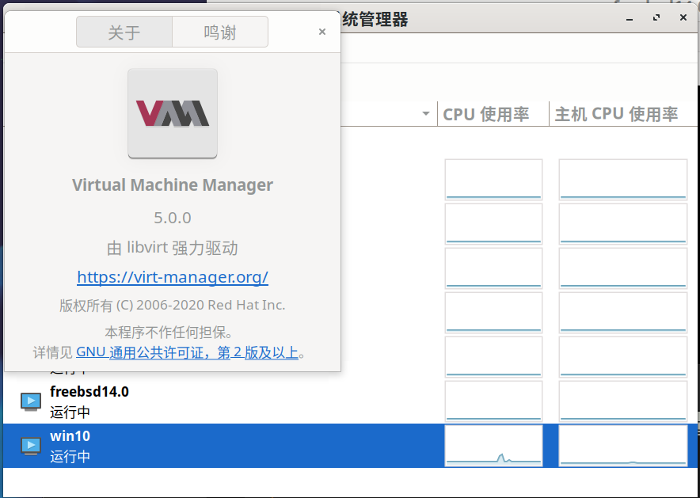

# 在 Windows 与 BSD 平台上使用 Ansible

{{#include inventories_building.md:3:7}}

欢迎来到 Microsoft Windows 和 BSD 的 Ansible 指南。由于 Windows 不是 POSIX 兼容的操作系统，因此 Ansible 与 Windows 主机的交互方式，与 Linux/Unix 主机不同。同样，管理运行 BSD 的主机，也不同于管理其他类 Unix 主机操作系统。请了解在 Windows 和 BSD 主机上，使用 Ansible 所需的一切信息。

> **译注**：译者使用了运行在 KVM 上的 FreeBSD 14.2 与 Windows 10 LTSC，作为实验用系统。

（End）

